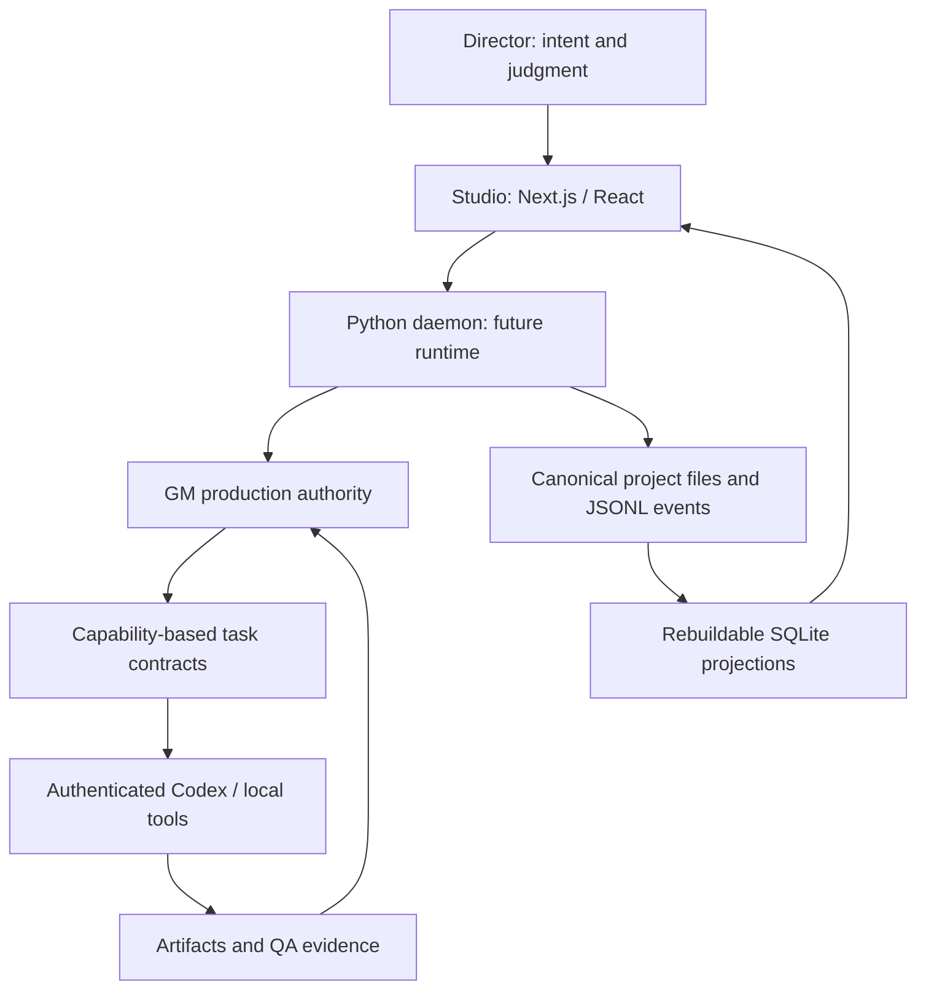

# Game Agent Network

A local-first production orchestration foundation for turning human game direction
into accountable tasks, specialist work and inspectable evidence.

**Status: Phase -1 and Phase 0.** This repository contains the constitution and
buildable monorepo. It does not yet orchestrate workers, load projects, persist
history or generate game assets. The only Studio page validates the shared UI
package. No fabricated production metrics or screenshots are presented.

## Architecture



The runtime boxes above describe the target architecture. Phase 0 implements
their contracts and pure invariant checks. Pydantic generates JSON Schema and
TypeScript; a shared fixture corpus validates both languages.

| Principle                              | Foundation implementation                                        |
| -------------------------------------- | ---------------------------------------------------------------- |
| GM owns production authority           | Pure command/event admission and state-machine checks            |
| Agents are capability packages         | Versioned schemas, separate tools and project assignments        |
| Human judgment overrides scores        | Completion rejects human-rejected work                           |
| QA needs evidence                      | Scoped provenance, independent capture and human-evidence checks |
| No uncapped paid providers             | Fail-closed cap/budget admission rules                           |
| Project identity stays isolated        | Global definitions exclude context; thread scope validation      |
| Local project history remains portable | Event contracts and persistence ADRs                             |

## Local setup (PowerShell)

Requires Node 24, pnpm 11.20.0 and Python 3.12+.

```powershell
python -m pip install uv==0.8.13
python -m uv sync --frozen --project services/daemon
pnpm install --frozen-lockfile
Copy-Item .env.example .env
pnpm check
pnpm dev
```

Open the localhost address printed by Studio. Its port comes from
`GAMEAGENT_STUDIO_PORT` in `.env`; the example config uses the PRD's 4242 default.
No API key or external service is required.

## Development

| Command                  | Purpose                                                                         |
| ------------------------ | ------------------------------------------------------------------------------- |
| `pnpm check`             | Formatting, lint, generated-schema drift, typechecks, tests, builds, HTTP smoke |
| `pnpm test`              | Cross-language contracts and Python constitution/boundary tests                 |
| `pnpm protocol:generate` | Regenerate JSON Schema and TypeScript after model changes                       |
| `pnpm format`            | Format owned files; preserves the original PRD                                  |
| `pnpm build`             | Build all TS packages, Studio, Python wheel and source distribution             |
| `pnpm dev`               | Run the minimal shared-UI foundation page                                       |

## Design records

- [Greenlight harvest](docs/GREENLIGHT_HARVEST.md)
- [Monorepo structure](docs/architecture/MONOREPO.md)
- [Domain vocabulary](docs/architecture/VOCABULARY.md)
- [Invariant coverage and runtime limits](docs/architecture/INVARIANTS.md)
- [Architectural decisions](docs/decisions/)
- [Phase 0 handoff](docs/development/PHASE_0_HANDOFF.md)

## Roadmap

| Phase  | Scope                                                            |
| ------ | ---------------------------------------------------------------- |
| -1 / 0 | Harvest, contracts, constitution, monorepo and CI                |
| 1      | Project protocol, persistence, daemon API and Studio shell       |
| 2–5    | Authenticated Codex, reconciliation, GM matching, intelligence   |
| 6–7    | Cosmic Meltdown UI workflow and evidence-backed QA               |
| 8–10   | Local model routing, real budget gateway, specialist recruitment |
| 11–12  | Additional disciplines and desktop packaging                     |

The eventual demo follows a real UI change through planning, implementation,
runtime capture, QA rejection/revision and integration. Director Desk, Network
and QA screenshots will be added once those real workflows exist.
