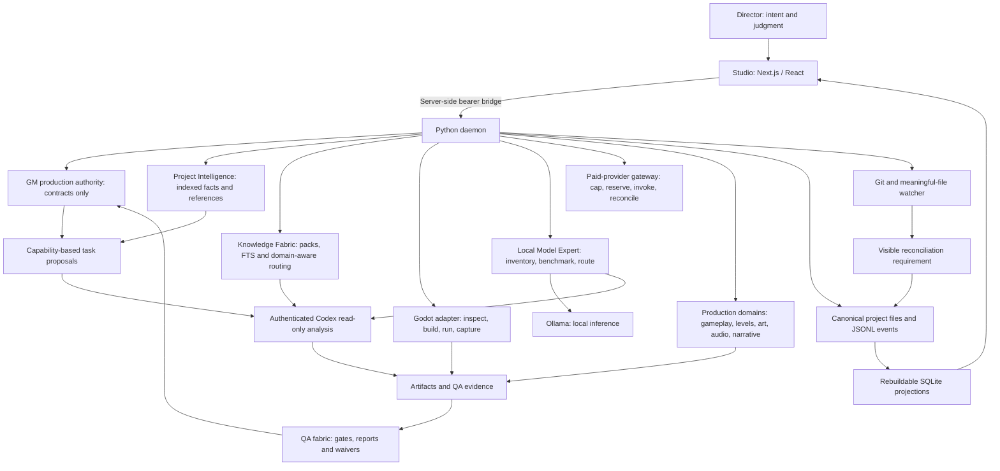

# Game Agent Network

A local-first production orchestration foundation for turning human game direction
into accountable tasks, specialist work and inspectable evidence.

**Status: Phases 7–12 implemented.** The persistent project GM turns objectives into
typed multidisciplinary plans, while Project Intelligence indexes repository
files, design documents, decisions, and asset references into bounded,
provenance-aware worker context. The first Godot adapter now inspects nested Godot
projects and UI nodes, builds the project, opens a selected dropdown in the real
scene, captures a runtime PNG, records evidence plus evaluation events, and exposes
the verified artifact in Studio. Direct agents can register meaningful work through
the CLI; each GAN-enabled repository receives managed `AGENTS.md` instructions.
The daemon watches project files, Git status, and commits, records unregistered
changes, and keeps Studio visibly unresolved until those changes are attributed
through reconciliation. The recruiter now detects missing capability contracts,
searches the global roster and adjacent capabilities, filters tools through task
permissions, runs separate read-only candidate and reviewer auditions, and admits
passing specialists into globally reusable probation. The QA fabric now applies
reusable UI and engineering gates across deterministic, measured, comparative,
heuristic, and human evidence. It shows why each gate passed, failed, remains
advisory, or was explicitly waived. Probationary QA advice requires independent
verification, and Director rejection always wins.
The Local Model Expert inventories actual workstation hardware and Ollama models,
records content-addressed representative benchmarks, and compares deterministic,
local, authenticated Codex, paid, and wait routes. Every recommendation preserves
quality, confidence, measured runtime, external cost, and rationale. Paid execution
now passes through a single fail-closed gateway with verified provider-side cap
proof, atomic monthly reservations, exact approval at $1.00 or more, secure OS
credentials, idempotent calls, and conservative timeout recovery.
Phase 11 adds gameplay, level-design, art, audio, and narrative vertical slices.
Each discipline has a versioned contract, installed read-only inspection tool,
evidence-backed QA gate, canonical task history, and Studio representation. These
structural audits deliberately do not promote file validity into claims about
creative quality, behavior, continuity, mix, or fun.
The Knowledge Fabric now qualifies specialists with reviewed, versioned Expertise
Packs and assembles task-scoped packets from separate project and discipline
planes. Its first roster includes Game UX, Game Engineering, Game QA, and Godot UI
Engineering packs. Agent Inspector shows the exact pack versions, methods, sources,
freshness, retrieved context and observed method/pack outcomes. Worker results expose
an expandable evidence-separated “Why?” view. Missing required expertise moves a
planned task or onboarding assessment to `BLOCKED_KNOWLEDGE`; it does not masquerade
as a generic failure. Project Intelligence is never copied into the global expertise store.
Phase 12 packages the same local architecture as a Windows x64 desktop application.
Electron owns the Studio and daemon process lifecycle but no production decisions;
the authenticated daemon remains authoritative. A separate headless daemon bundle
preserves CLI and service workflows without Electron.

## Architecture



Pydantic owns the contracts and generates JSON Schema and TypeScript. Project
events are canonical; SQLite and Studio state are rebuildable views.

| Principle                               | Foundation implementation                                    |
| --------------------------------------- | ------------------------------------------------------------ |
| GM owns production authority            | Pure command/event admission and state-machine checks        |
| Agents are capability packages          | Versioned schemas, separate tools and project assignments    |
| Human judgment overrides scores         | Canonical human review and rejection precedence              |
| QA needs evidence                       | Typed gates, scoped evidence, rationale and audited waivers  |
| Model routing needs evidence            | Live inventory, representative benchmarks and route records  |
| No uncapped paid providers              | Verified caps, atomic reservations and one execution gateway |
| New disciplines ship vertically         | Contract, tool, QA, evidence, history and Studio together    |
| Project identity stays isolated         | Global definitions exclude context; thread scope validation  |
| Expertise stays qualified and traceable | Versioned packs, provenance, freshness and packet references |
| Local project history remains portable  | Durable rotated JSONL, replay and rebuildable SQLite         |

## Local setup (PowerShell)

Requires Node 24, pnpm 11.20.0 and Python 3.12+.

```powershell
python -m pip install uv==0.8.13
python -m uv sync --frozen --project services/daemon
pnpm install --frozen-lockfile
pnpm exec playwright install chromium
Copy-Item .env.example .env
python -m uv run --project services/daemon gameagent init C:/path/to/your/game
pnpm check
pnpm dev
```

Set `GAMEAGENT_PROJECT_PATH` to that game repository and replace the token value
in `.env` with a random string of at least 32 characters. The URLs and ports also
come from `.env`. Open the localhost address printed by Studio. The worker bridge
reuses the Codex ChatGPT login and clears API-key environment variables. Set
`GAMEAGENT_CODEX_BIN` only when the current Codex executable is not on `PATH`.
Python 3.12+ is discovered automatically; set `GAMEAGENT_PYTHON` only when an
explicit interpreter path is required.
Set `GAMEAGENT_OLLAMA_URL` to the local Ollama endpoint to enable inventory and
benchmarks. `GAMEAGENT_OLLAMA_BENCHMARK_TIMEOUT_SECONDS` controls generation time;
missing or unhealthy Ollama state fails closed and remains visible in Studio.
Optional paid-provider adapter metadata is configured with the
`GAMEAGENT_PROVIDER_*` dotenv fields. Store the credential from the Providers page;
GAN writes it to Windows Credential Manager and never to `.env` or project history.
Set `GAMEAGENT_KNOWLEDGE_HOME` only to move the canonical global Expertise Pack
directory from its default `~/.gameagent/knowledge/` location.
The Project Intelligence page includes the expertise library, pack draft builder,
independent audition/review controls, current research and project learning.
`GAMEAGENT_RESEARCH_HOSTS` is an exact, comma-separated allowlist of authoritative
HTTPS hostnames; empty disables research. Task network permission is also required.
`GAMEAGENT_BACKGROUND_LEARNING=1` enables idle-only local QA capture/distillation
at `GAMEAGENT_LEARNING_INTERVAL_SECONDS` intervals. It never buys provider calls or
promotes lessons, and its idle/running/waiting/failed state is visible in Studio.
Global lesson export requires a separate explicit privacy and
generalization review; project evidence stays local.

`gameagent init` detects the repository and likely engine/rendering mode, records
documents, assets and Git HEAD, and lists important unknowns without an intake
questionnaire. Use `--profile path/to/project.yaml` only when an explicit Project
contract should replace the detected baseline.

Select the project name in Studio to switch projects or add another local
repository. Import initializes `.gameagent` when needed. GAN does not automatically
clone or execute remote repositories.

Register direct project work before editing. A new task uses default capability
and deliverable labels unless they are supplied explicitly:

```powershell
gameagent task start C:/path/to/game --title "Tune movement" --objective "Movement feels responsive"
gameagent task status C:/path/to/game
gameagent task complete C:/path/to/game --task-id TASK_ID --detail "Adjusted acceleration and documented the result"
```

Use `gameagent task block` when progress stops. If files or commits changed with
no active task, Studio and `gameagent task status` report an unresolved change;
run `gameagent reconcile C:/path/to/game --detail "What changed and why"` to
attribute it. Reconciliation does not erase history: it creates a reconstructed
task in `REVIEW` and records Git context plus content-addressed surviving files.

## Development

| Command                    | Purpose                                                                        |
| -------------------------- | ------------------------------------------------------------------------------ |
| `pnpm check`               | Format/lint/schema drift/types/tests/build plus Studio↔daemon Playwright smoke |
| `pnpm test`                | Cross-language contracts and Python constitution/boundary tests                |
| `pnpm protocol:generate`   | Regenerate JSON Schema and TypeScript after model changes                      |
| `pnpm format`              | Format owned files; preserves the original PRD                                 |
| `pnpm build`               | Build all TS packages, Studio, Python wheel and source distribution            |
| `pnpm dev`                 | Run the configured daemon and Studio together                                  |
| `pnpm desktop:package:dir` | Build an unpacked Windows x64 desktop application                              |
| `pnpm desktop:package`     | Build the Windows x64 NSIS installer and headless daemon bundle                |
| `gameagent status PATH`    | Replay canonical history and print the current project snapshot                |
| `gameagent rebuild PATH`   | Recreate the SQLite projection from canonical events                           |
| `gameagent task …`         | Start, inspect, block, or report completion of meaningful direct work          |
| `gameagent reconcile`      | Attribute detected work that happened without prior registration               |

## Design records

- [Greenlight harvest](docs/GREENLIGHT_HARVEST.md)
- [Monorepo structure](docs/architecture/MONOREPO.md)
- [Domain vocabulary](docs/architecture/VOCABULARY.md)
- [Invariant coverage and runtime limits](docs/architecture/INVARIANTS.md)
- [Architectural decisions](docs/decisions/)
- [Knowledge Fabric storage decision](docs/decisions/0012-canonical-knowledge-fabric-storage.md)
- [Phase 0 handoff](docs/development/PHASE_0_HANDOFF.md)
- [Phase 1 handoff](docs/development/PHASE_1_HANDOFF.md)
- [Phase 2 handoff](docs/development/PHASE_2_HANDOFF.md)
- [Phase 3 handoff](docs/development/PHASE_3_HANDOFF.md)
- [Phase 4 handoff](docs/development/PHASE_4_HANDOFF.md)
- [Phase 5 handoff](docs/development/PHASE_5_HANDOFF.md)
- [Phase 6 handoff](docs/development/PHASE_6_HANDOFF.md)
- [Phase 7 handoff](docs/development/PHASE_7_HANDOFF.md)
- [Phase 8 handoff](docs/development/PHASE_8_HANDOFF.md)
- [Phase 9 handoff](docs/development/PHASE_9_HANDOFF.md)
- [Phase 10 handoff](docs/development/PHASE_10_HANDOFF.md)
- [Phase 11 handoff](docs/development/PHASE_11_HANDOFF.md)

## Roadmap

| Phase  | Scope                                                               |
| ------ | ------------------------------------------------------------------- |
| -1 / 0 | Harvest, contracts, constitution, monorepo and CI                   |
| 1      | Complete: project protocol, persistence, daemon and Studio shell    |
| 2      | Complete: authenticated Codex worker bridge                         |
| 3      | Complete: registration, change detection and reconciliation         |
| 4      | Complete: GM planning, matching and decision inbox                  |
| 5      | Complete: project intelligence and targeted context assembly        |
| 6      | Complete: Cosmic Meltdown Godot UI vertical slice                   |
| 10     | Complete ahead of Phase 7: recruiter, auditions and global registry |
| 7      | Complete: evidence-backed QA fabric                                 |
| 8      | Complete: local model expert and explainable model router           |
| 9      | Complete: verified-cap provider budget and execution gateway        |
| 11     | Complete: gameplay, level design, art, audio and narrative slices   |
| 12     | Implemented: Windows desktop shell, installer and headless daemon   |

The eventual public portfolio can host the Studio presentation layer separately.
The local daemon owns filesystem access and durable project state, so it is not a
Vercel Function. A hosted read-only demo transport can be added when it can show
clearly identified evidence without fabricating production state.
