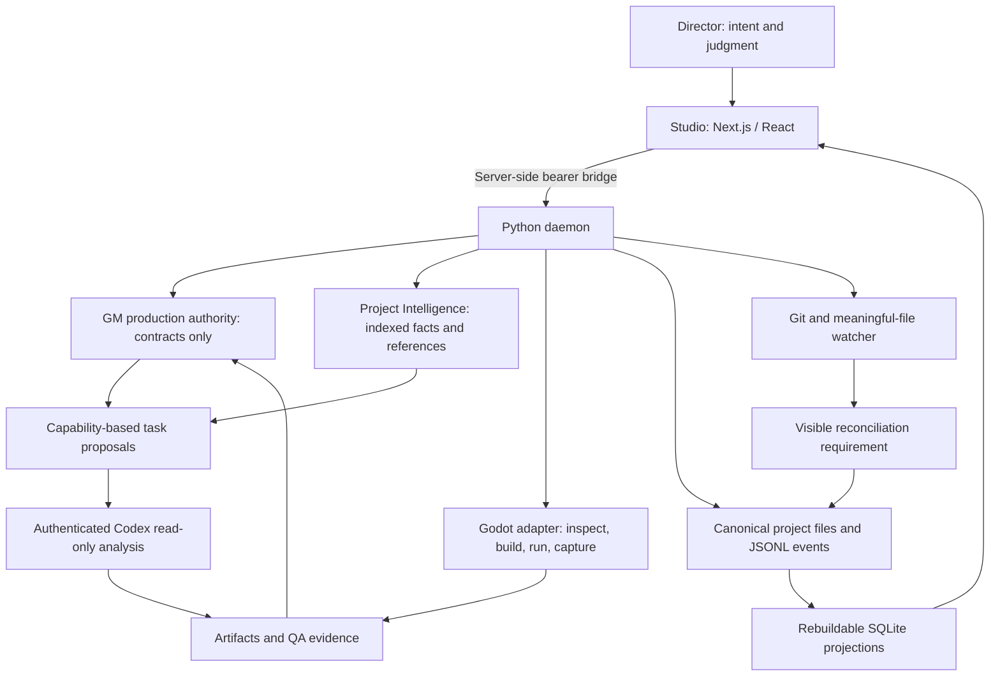

# Game Agent Network

A local-first production orchestration foundation for turning human game direction
into accountable tasks, specialist work and inspectable evidence.

**Status: Phase 6 complete.** The persistent project GM turns objectives into
typed multidisciplinary plans, while Project Intelligence indexes repository
files, design documents, decisions, and asset references into bounded,
provenance-aware worker context. The first Godot adapter now inspects nested Godot
projects and UI nodes, builds the project, opens a selected dropdown in the real
scene, captures a runtime PNG, records evidence plus evaluation events, and exposes
the verified artifact in Studio. Direct agents can register meaningful work through
the CLI; each GAN-enabled repository receives managed `AGENTS.md` instructions.
The daemon watches project files, Git status, and commits, records unregistered
changes, and keeps Studio visibly unresolved until those changes are attributed
through reconciliation. Phase 7 generalizes this vertical slice into the QA fabric.

## Architecture



Pydantic owns the contracts and generates JSON Schema and TypeScript. Project
events are canonical; SQLite and Studio state are rebuildable views.

| Principle                              | Foundation implementation                                        |
| -------------------------------------- | ---------------------------------------------------------------- |
| GM owns production authority           | Pure command/event admission and state-machine checks            |
| Agents are capability packages         | Versioned schemas, separate tools and project assignments        |
| Human judgment overrides scores        | Completion rejects human-rejected work                           |
| QA needs evidence                      | Scoped provenance, independent capture and human-evidence checks |
| No uncapped paid providers             | Fail-closed cap/budget admission rules                           |
| Project identity stays isolated        | Global definitions exclude context; thread scope validation      |
| Local project history remains portable | Durable rotated JSONL, replay and rebuildable SQLite             |

## Local setup (PowerShell)

Requires Node 24, pnpm 11.20.0 and Python 3.12+.

```powershell
python -m pip install uv==0.8.13
python -m uv sync --frozen --project services/daemon
pnpm install --frozen-lockfile
pnpm exec playwright install chromium
Copy-Item .env.example .env
python -m uv run --project services/daemon gameagent init C:/path/to/your/game
pnpm check
pnpm dev
```

Set `GAMEAGENT_PROJECT_PATH` to that game repository and replace the token value
in `.env` with a random string of at least 32 characters. The URLs and ports also
come from `.env`. Open the localhost address printed by Studio. The worker bridge
reuses the Codex ChatGPT login and clears API-key environment variables. Set
`GAMEAGENT_CODEX_BIN` only when the current Codex executable is not on `PATH`.
Python 3.12+ is discovered automatically; set `GAMEAGENT_PYTHON` only when an
explicit interpreter path is required.

`gameagent init` detects the repository and likely engine/rendering mode, records
documents, assets and Git HEAD, and lists important unknowns without an intake
questionnaire. Use `--profile path/to/project.yaml` only when an explicit Project
contract should replace the detected baseline.

Select the project name in Studio to switch projects or add another local
repository. Import initializes `.gameagent` when needed. GAN does not automatically
clone or execute remote repositories.

Register direct project work before editing. A new task uses default capability
and deliverable labels unless they are supplied explicitly:

```powershell
gameagent task start C:/path/to/game --title "Tune movement" --objective "Movement feels responsive"
gameagent task status C:/path/to/game
gameagent task complete C:/path/to/game --task-id TASK_ID --detail "Adjusted acceleration and documented the result"
```

Use `gameagent task block` when progress stops. If files or commits changed with
no active task, Studio and `gameagent task status` report an unresolved change;
run `gameagent reconcile C:/path/to/game --detail "What changed and why"` to
attribute it. Reconciliation does not erase history: it creates a reconstructed
task in `REVIEW` and records Git context plus content-addressed surviving files.

## Development

| Command                  | Purpose                                                                        |
| ------------------------ | ------------------------------------------------------------------------------ |
| `pnpm check`             | Format/lint/schema drift/types/tests/build plus Studio↔daemon Playwright smoke |
| `pnpm test`              | Cross-language contracts and Python constitution/boundary tests                |
| `pnpm protocol:generate` | Regenerate JSON Schema and TypeScript after model changes                      |
| `pnpm format`            | Format owned files; preserves the original PRD                                 |
| `pnpm build`             | Build all TS packages, Studio, Python wheel and source distribution            |
| `pnpm dev`               | Run the configured daemon and Studio together                                  |
| `gameagent status PATH`  | Replay canonical history and print the current project snapshot                |
| `gameagent rebuild PATH` | Recreate the SQLite projection from canonical events                           |
| `gameagent task …`       | Start, inspect, block, or report completion of meaningful direct work          |
| `gameagent reconcile`    | Attribute detected work that happened without prior registration               |

## Design records

- [Greenlight harvest](docs/GREENLIGHT_HARVEST.md)
- [Monorepo structure](docs/architecture/MONOREPO.md)
- [Domain vocabulary](docs/architecture/VOCABULARY.md)
- [Invariant coverage and runtime limits](docs/architecture/INVARIANTS.md)
- [Architectural decisions](docs/decisions/)
- [Phase 0 handoff](docs/development/PHASE_0_HANDOFF.md)
- [Phase 1 handoff](docs/development/PHASE_1_HANDOFF.md)
- [Phase 2 handoff](docs/development/PHASE_2_HANDOFF.md)
- [Phase 3 handoff](docs/development/PHASE_3_HANDOFF.md)
- [Phase 4 handoff](docs/development/PHASE_4_HANDOFF.md)
- [Phase 5 handoff](docs/development/PHASE_5_HANDOFF.md)
- [Phase 6 handoff](docs/development/PHASE_6_HANDOFF.md)

## Roadmap

| Phase  | Scope                                                            |
| ------ | ---------------------------------------------------------------- |
| -1 / 0 | Harvest, contracts, constitution, monorepo and CI                |
| 1      | Complete: project protocol, persistence, daemon and Studio shell |
| 2      | Complete: authenticated Codex worker bridge                      |
| 3      | Complete: registration, change detection and reconciliation      |
| 4      | Complete: GM planning, matching and decision inbox               |
| 5      | Complete: project intelligence and targeted context assembly     |
| 6      | Complete: Cosmic Meltdown Godot UI vertical slice                |
| 7      | Evidence-backed QA fabric                                        |
| 8–10   | Local model routing, real budget gateway, specialist recruitment |
| 11–12  | Additional disciplines and desktop packaging                     |

The eventual public portfolio can host the Studio presentation layer separately.
The local daemon owns filesystem access and durable project state, so it is not a
Vercel Function. A hosted read-only demo transport can be added when it can show
clearly identified evidence without fabricating production state.
